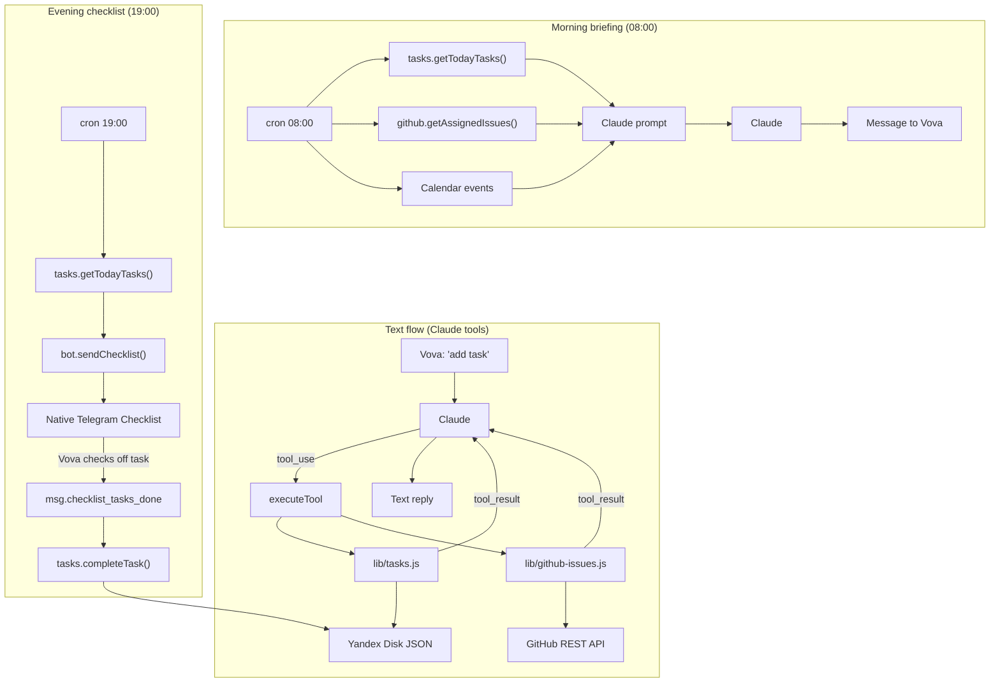

# Task Tracking Feature Spec

## Goal

Snezhanna accepts tasks in free-form text, stores them as JSON on Yandex Disk, pulls open GitHub Issues where Vova is the assignee, and prioritizes everything using the Eisenhower Matrix. Morning briefing includes tasks alongside the calendar. Evening check-in sends a native Telegram Checklist so Vova can check off tasks directly in the app.

---

## Eisenhower Matrix

Two independent boolean fields replace a single `priority` field:

|                | Important           | Not important              |
|----------------|---------------------|----------------------------|
| **Urgent**     | Q1 — do now         | Q3 — delegate / quick fix  |
| **Not urgent** | Q2 — schedule       | Q4 — defer                 |

Display order in briefing and checklist: **Q1 → Q3 → Q2 → Q4**

---

## Data model

```json
{
  "id": "1741000000000",
  "title": "Call Alexey",
  "status": "todo",
  "urgent": true,
  "important": true,
  "project": null,
  "tags": ["calls"],
  "due_date": "2026-03-07",
  "created_at": "2026-03-04T10:00:00.000Z",
  "updated_at": "2026-03-04T10:00:00.000Z",
  "notes": ""
}
```

Fields:
- `id` — string, `Date.now()` at creation time
- `status` — `"todo"` | `"in_progress"` | `"done"` | `"cancelled"`
- `urgent` — boolean
- `important` — boolean
- `project` — `null` for global tasks, project name string for project tasks
- `due_date` — `"YYYY-MM-DD"` or `null`
- `tags` — array of strings (optional)

---

## Storage

- **Global tasks:** `/mnt/yadisk-agent/tasks/tasks.json`
- **Project tasks:** `/mnt/yadisk-agent/projects/{name}/tasks.json`
- **GitHub Issues:** not stored locally — fetched live from API

---

## New file: `lib/tasks.js`

Exports 6 async functions:

```
addTask(title, options)         → created task object
listTasks(filter)               → array sorted by Eisenhower matrix
updateTask(id, project, patch)  → updated task object
completeTask(id, project)       → updated task object
deleteTask(id, project)         → { success: true }
getTodayTasks()                 → tasks with due_date = today and status todo/in_progress,
                                   across all files, sorted by Eisenhower matrix
```

`options` for `addTask`: `{ urgent, important, project, due_date, tags, notes }`
`filter` for `listTasks`: `{ project, status, urgent, important, tag }`

Private helpers:
- `_getFilePath(project)` — returns path to the right `tasks.json`
- `_readTasks(project)` — reads and parses file (returns `[]` if missing)
- `_writeTasks(project, tasks)` — serializes and writes file
- `_eisenhowerSort(tasks)` — sorts: Q1 → Q3 → Q2 → Q4

---

## New file: `lib/github-issues.js`

Single HTTP request to GitHub REST API using the built-in `https` module — no npm dependencies:

```javascript
async function getAssignedIssues() {
  // GET https://api.github.com/issues?filter=assigned&state=open&per_page=50
  // Authorization: Bearer GITHUB_TOKEN
  // Returns array of: { id, title, repo, url, labels, created_at }
}
```

New environment variable: `GITHUB_TOKEN` (Personal Access Token, scope: `repo` or `read:org`).
Add to `.env` and `systemd/snezhanna.service`.

---

## New tools in `lib/tools.js`

6 new entries in the `TOOLS` array + 6 new `case` branches in `executeTool()`:

- `add_task` — `title` (req), `urgent?`, `important?`, `project?`, `due_date?`, `tags?`, `notes?`
- `list_tasks` — `project?`, `status?`, `urgent?`, `important?`, `tag?`
- `update_task` — `id` (req), `project?`, + any fields to update
- `complete_task` — `id` (req), `project?`
- `delete_task` — `id` (req), `project?`
- `get_github_issues` — no params; returns open issues where Vova is assignee

---

## Changes to `lib/state.js`

Add field `businessConnectionId: null` to initial state object.

---

## Changes to `index.js`

### 1. Morning briefing (08:00) — add tasks

After the calendar events block, fetch tasks and GitHub issues and include them in the Claude prompt:

```javascript
const todayTasks = await tasks.getTodayTasks();

let ghIssues = [];
try { ghIssues = await github.getAssignedIssues(); } catch(e) {}

const tasksSection = formatTasksForBriefing(todayTasks, ghIssues);
// include tasksSection in the prompt alongside eventsText
```

`formatTasksForBriefing()` groups tasks by quadrant:

```
Q1 (urgent+important): Call Alexey [by 18:00]
Q2 (not urgent+important): Review DB architecture
GitHub Issues: fix: login bug (#42, repo/project)
```

### 2. Evening check-in (19:00) — native Telegram Checklist

After Claude's text reply, if `businessConnectionId` is set:

```javascript
const todayTasks = await tasks.getTodayTasks();
if (todayTasks.length > 0 && appState.businessConnectionId) {
  await bot.sendChecklist(appState.businessConnectionId, appState.chatId, {
    title: "Today's tasks",
    tasks: todayTasks.map((t, i) => ({ id: i + 1, text: t.title }))
  });
}
```

### 3. Business connection handler (new)

```javascript
bot.on('business_connection', (conn) => {
  appState.businessConnectionId = conn.id;
  saveState();
});
```

### 4. Checklist completion handler (new)

```javascript
// Inside bot.on('message') — new branch:
if (msg.checklist_tasks_done) {
  const doneIds = msg.checklist_tasks_done.marked_as_done_task_ids || [];
  for (const id of doneIds) {
    await tasks.completeTask(String(id), null);
  }
}
```

---

## Architecture



---

## One-time manual setup (before implementation)

1. **BotFather** → `/mybots` → Snezhanna → Bot Settings → **Business Mode → Turn on**
2. **Telegram** → Settings → Telegram Business → **Chatbots** → add the bot
3. Create a GitHub Personal Access Token (scope: `repo` or `read:org`) → add to `.env` as `GITHUB_TOKEN`

---

## Files changed

| File | Change |
|---|---|
| `lib/tasks.js` | New file |
| `lib/github-issues.js` | New file |
| `lib/state.js` | Add `businessConnectionId` field |
| `lib/yadisk-dirs.js` | Add `tasks/` to REQUIRED_DIRS, replace tasks.md template with tasks.json |
| `lib/tools.js` | 6 new tools |
| `index.js` | 2 new handlers + tasks in briefing + checklist in evening check-in |
| `identity/IDENTITY.md` | Add tasks and GitHub section |
| `.env` + `systemd/snezhanna.service` | Add `GITHUB_TOKEN` |
| `package.json` | `node-telegram-bot-api` → v0.67+ |

`config/nanobot.json` and `watchdog/zhora.js` — no changes.

---

## Implementation order

1. Manual setup: BotFather + Telegram Business + GitHub Token
2. `npm install node-telegram-bot-api@latest`
3. Create `lib/tasks.js`
4. Create `lib/github-issues.js`
5. Update `lib/state.js`
6. Update `lib/yadisk-dirs.js`
7. Add tools to `lib/tools.js`
8. Update `index.js` (4 changes)
9. Update `identity/IDENTITY.md`
10. Restart service, check `journalctl`
