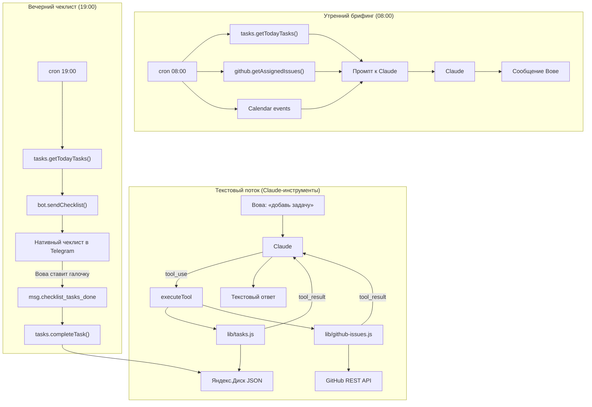

# ТЗ: Таск-трекинг в Snezhanna

## Цель

Снежанна принимает задачи в произвольной форме, хранит их в JSON на Яндекс.Диске, собирает открытые GitHub Issues где Вова — assignee, приоритизирует всё по матрице Эйзенхауэра. Утром — сводка задач вместе с календарём. Вечером — нативный Telegram Checklist с задачами на день.

---

## Матрица Эйзенхауэра

Вместо одного поля `priority` — два независимых признака:

|               | Важная              | Неважная                           |
| ------------- | ------------------- | ---------------------------------- |
| **Срочная**   | Q1 — сделать сейчас | Q3 — делегировать / быстро закрыть |
| **Несрочная** | Q2 — запланировать  | Q4 — отложить                      |

Порядок вывода в брифинге и чеклисте: **Q1 → Q3 → Q2 → Q4**

---

## Модель данных

```json
{
  "id": "1741000000000",
  "title": "Позвонить Алексею",
  "status": "todo",
  "urgent": true,
  "important": true,
  "project": null,
  "tags": ["звонки"],
  "due_date": "2026-03-07",
  "created_at": "2026-03-04T10:00:00.000Z",
  "updated_at": "2026-03-04T10:00:00.000Z",
  "notes": ""
}
```

Поля:
- `id` — строка, `Date.now()` в момент создания
- `status` — `"todo"` | `"in_progress"` | `"done"` | `"cancelled"`
- `urgent` — boolean (срочная)
- `important` — boolean (важная)
- `project` — `null` для глобальных, имя проекта для проектных
- `due_date` — `"YYYY-MM-DD"` или `null`
- `tags` — массив строк (опционально)

---

## Хранилище

- **Глобальные задачи:** `/mnt/yadisk-agent/tasks/tasks.json`
- **Задачи проекта:** `/mnt/yadisk-agent/projects/{name}/tasks.json`
- **GitHub Issues:** не хранятся локально — запрашиваются живьём через API

---

## Новый файл: `lib/tasks.js`

Экспортирует 6 функций (все `async`):

```
addTask(title, options)         → созданная задача
listTasks(filter)               → массив задач, отсортированный по матрице Эйзенхауэра
updateTask(id, project, patch)  → обновлённая задача
completeTask(id, project)       → обновлённая задача
deleteTask(id, project)         → { success: true }
getTodayTasks()                 → задачи с due_date = сегодня и статусом todo/in_progress,
                                   из всех файлов, отсортированные по матрице
```

`options` для `addTask`: `{ urgent, important, project, due_date, tags, notes }`
`filter` для `listTasks`: `{ project, status, urgent, important, tag }`

Приватные функции:
- `_getFilePath(project)` — путь к нужному `tasks.json`
- `_readTasks(project)` — читает файл (возвращает `[]` если не существует)
- `_writeTasks(project, tasks)` — сериализует и пишет
- `_eisenhowerSort(tasks)` — сортирует: Q1 → Q3 → Q2 → Q4

---

## Новый файл: `lib/github-issues.js`

Один HTTP-запрос к GitHub REST API — без внешних зависимостей, через встроенный `https`:

```javascript
async function getAssignedIssues() {
  // GET https://api.github.com/issues?filter=assigned&state=open&per_page=50
  // Authorization: Bearer GITHUB_TOKEN
  // Возвращает массив: { id, title, repo, url, labels, created_at }
}
```

Новая переменная окружения: `GITHUB_TOKEN` (Personal Access Token, scope: `repo` или `read:org`).
Добавить в `.env` и в `systemd/snezhanna.service`.

---

## Новые инструменты в `lib/tools.js`

6 новых записей в массиве `TOOLS` + 6 новых `case` в `executeTool()`:

- `add_task` — `title` (req), `urgent?`, `important?`, `project?`, `due_date?`, `tags?`, `notes?`
- `list_tasks` — `project?`, `status?`, `urgent?`, `important?`, `tag?`
- `update_task` — `id` (req), `project?`, + любые поля для обновления
- `complete_task` — `id` (req), `project?`
- `delete_task` — `id` (req), `project?`
- `get_github_issues` — без параметров; возвращает список открытых issues где Вова assignee

---

## Изменения в `lib/state.js`

Добавить поле `businessConnectionId: null` в начальное состояние.

---

## Изменения в `index.js`

### 1. Утренний брифинг (08:00) — добавить задачи

После блока с Calendar-событиями добавить в промпт раздел с задачами на сегодня и GitHub Issues:

```javascript
// Задачи из JSON (due_date = today, sorted by Eisenhower)
const todayTasks = await tasks.getTodayTasks();

// GitHub Issues (живой запрос)
let ghIssues = [];
try { ghIssues = await github.getAssignedIssues(); } catch(e) {}

const tasksSection = formatTasksForBriefing(todayTasks, ghIssues);
// tasksSection включается в промпт к Claude рядом с eventsText
```

Вспомогательная функция `formatTasksForBriefing()` форматирует задачи по квадрантам:

```
Q1 (срочное+важное): Позвонить Алексею [до 18:00]
Q2 (несрочное+важное): Согласовать архитектуру БД
GitHub Issues: fix: login bug (#42, repo/project)
```

### 2. Вечерний чек-ин (19:00) — нативный Telegram Checklist

После текстового ответа Claude, если `businessConnectionId` сохранён:

```javascript
const todayTasks = await tasks.getTodayTasks();
if (todayTasks.length > 0 && appState.businessConnectionId) {
  await bot.sendChecklist(appState.businessConnectionId, appState.chatId, {
    title: 'Задачи на сегодня',
    tasks: todayTasks.map((t, i) => ({ id: i + 1, text: t.title }))
  });
}
```

### 3. Обработчик Business-подключения (новый)

```javascript
bot.on('business_connection', (conn) => {
  appState.businessConnectionId = conn.id;
  saveState();
});
```

### 4. Обработчик отметки задач выполненными (новый)

```javascript
// Внутри bot.on('message') — новая ветка:
if (msg.checklist_tasks_done) {
  const doneIds = msg.checklist_tasks_done.marked_as_done_task_ids || [];
  for (const id of doneIds) {
    await tasks.completeTask(String(id), null);
  }
}
```

---

## Архитектура потоков данных



---

## Предварительная настройка (разово, вручную)

1. **BotFather** → `/mybots` → Снежанна → Bot Settings → **Business Mode → Turn on**
2. **Telegram** → Settings → Telegram Business → **Chatbots** → добавить бота
3. Создать GitHub Personal Access Token (scope: `repo` или `read:org`) → добавить в `.env` как `GITHUB_TOKEN`

---

## Файлы и их изменения

| Файл | Тип изменения |
|---|---|
| `lib/tasks.js` | Новый файл |
| `lib/github-issues.js` | Новый файл |
| `lib/state.js` | Добавить поле `businessConnectionId` |
| `lib/yadisk-dirs.js` | `tasks/` в REQUIRED_DIRS, шаблон tasks.json |
| `lib/tools.js` | 6 новых инструментов |
| `index.js` | 2 новых обработчика + задачи в брифинге + чеклист в чек-ине |
| `identity/IDENTITY.md` | Раздел про задачи и GitHub |
| `.env` + `systemd/snezhanna.service` | Переменная `GITHUB_TOKEN` |
| `package.json` | `node-telegram-bot-api` → v0.67+ |

`config/nanobot.json` и `watchdog/zhora.js` — не меняются.

---

## Порядок реализации

1. Вручную: BotFather Business Mode + Telegram Business Chatbots + GitHub Token
2. `npm install node-telegram-bot-api@latest`
3. Создать `lib/tasks.js`
4. Создать `lib/github-issues.js`
5. Обновить `lib/state.js`
6. Обновить `lib/yadisk-dirs.js`
7. Добавить инструменты в `lib/tools.js`
8. Обновить `index.js` (4 изменения)
9. Дописать `identity/IDENTITY.md`
10. Перезапустить сервис, проверить `journalctl`

---

## Сценарии использования

- «Снежанна, добавь срочную важную задачу: позвонить Алексею до пятницы» → `add_task(..., { urgent: true, important: true, due_date: "2026-03-07" })`
- Утром в 08:00 — в брифинге после событий календаря идут задачи по квадрантам + GitHub Issues
- «Покажи мои GitHub Issues» → `get_github_issues()`
- В 19:00 — нативный чеклист с задачами на сегодня, Вова ставит галочки
- Галочки в Telegram → автоматически обновляют `status: "done"` в JSON
